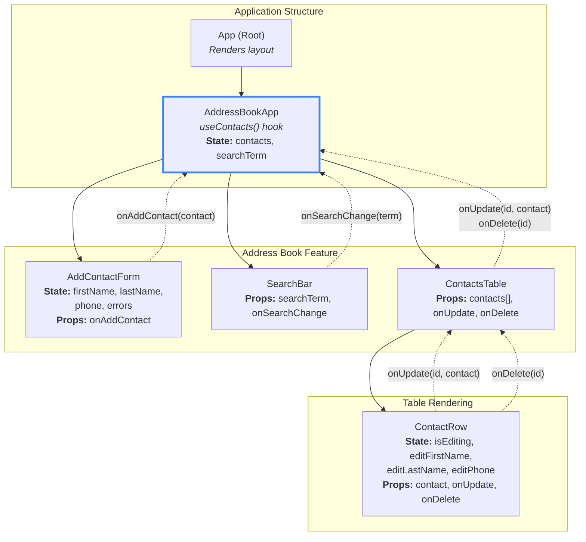

# Address Book

## Diagram Explained
### App (Root Component)
Кореневий компонент додатку

Просто рендерить компонент AddressBookApp

Не містить стану додатку

AddressBookApp (Smart Component)
Роль: Головний контейнер і "розумний" компонент

Керування станом: Викликає кастомний хук useContacts() і отримує:

contacts — масив контактів (відфільтрований за searchTerm)

searchTerm — поточний пошуковий запит

### Функції:

addContact(contact) — додати новий контакт

updateContact(id, contact) — оновити існуючий контакт

deleteContact(id) — видалити контакт

setSearchTerm(term) — оновити пошуковий запит

Потік даних вниз: Передає всі необхідні дані та функції дочірнім компонентам через пропси

Умовний рендеринг: Відображає "No data to display" якщо список порожній

AddContactForm (Presentational Component)
Роль: Компонент для додавання нових контактів з валідацією

### Локальний стан:

firstName — ім'я

lastName — прізвище

phone — номер телефону

errors — об'єкт з помилками валідації

Пропси: onAddContact — колбек для додавання контакту

### Валідація:

Всі поля обов'язкові

Помилки відображаються червоним під полями

Формат: "The <field name> is required"

Колбек вгору: При відправці форми викликає onAddContact({ firstName, lastName, phone })

SearchBar (Presentational Component)
Роль: Поле пошуку для фільтрації контактів в реальному часі

#### Пропси:

searchTerm — поточне значення пошуку

onSearchChange — колбек для оновлення пошуку

Колбек вгору: При зміні тексту викликає onSearchChange(term)

Особливості: Фільтрація відбувається на стороні клієнта без перезавантаження

ContactsTable (Presentational Component)
Роль: Відображає таблицю контактів з заголовками

#### Пропси:

contacts — масив об'єктів контактів

onUpdate — колбек для оновлення контакту

onDelete — колбек для видалення контакту

Структура таблиці:

ID

First Name

Last Name

Phone

Actions (Edit/Delete)

Умовний рендеринг: Якщо масив порожній, показує "No data to display"

Рендеринг списку: Перебирає масив contacts і рендерить ContactRow для кожного контакту

ContactRow (Presentational Component)
Роль: Відображає один рядок таблиці з можливістю редагування

### Локальний стан:

isEditing — режим редагування (boolean)

editFirstName, editLastName, editPhone — тимчасові значення під час редагування

#### Пропси:

contact — об'єкт контакту з полями id, firstName, lastName, phone

onUpdate — колбек

onDelete — колбек

### Режими роботи:

Display Mode: Показує дані та кнопки Edit/Delete

Edit Mode: Показує інпути з валідацією та кнопки Save/Cancel

Валідація при редагуванні:

Жодне поле не може бути порожнім

Помилки відображаються червоним

Колбеки вгору:

onUpdate(id, { firstName, lastName, phone }) — при збереженні змін

onDelete(id) — при кліку на кнопку видалення

Used Design Patterns
Custom Hook Pattern — useContacts інкапсулює всю логіку роботи з даними

Container/Presentational Pattern — розділення розумних і презентаційних компонентів

Controlled Components — всі інпути контролюються React-станом

State Colocation — локальний стан (errors, isEditing) зберігається там, де використовується

Unidirectional Data Flow — дані йдуть вниз через пропси, зміни вгору через колбеки

Composition Pattern — ContactsTable складається з багатьох ContactRow компонентів